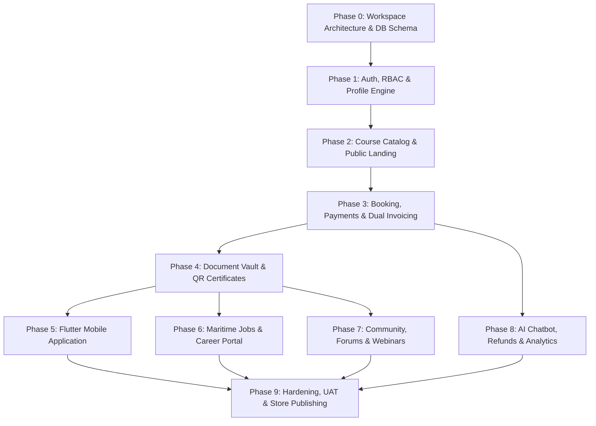

# The Seafu Platform — Comprehensive Phased Implementation Roadmap

The Seafu platform is a digital ecosystem for the Merchant Navy training and maritime sector, encompassing:
- **Backend API & Services**: NestJS (TypeScript) with backend-managed JWT/session auth
- **Database & Storage**: PostgreSQL & Supabase Storage via Supabase
- **Web Applications**: Nuxt (Vue 3) for Landing Website, Seafarer Panel, Institute Panel, and Admin Panel
- **Mobile Application**: Flutter (cross-platform for iOS and Android, seafarer-focused)
- **Push & Communications**: Firebase Cloud Messaging (FCM), SendGrid (Email), MSG91 (SMS/OTP), WhatsApp API
- **Payments**: Razorpay (Domestic UPI/cards) + Stripe (International multi-currency) integrated via NestJS backend
- **Infrastructure**: Vercel (Web / Landing) + Railway / AWS (NestJS API & background workers)

---

## User Review Required

> [!IMPORTANT]
> **Monorepo Architecture vs. Multi-Repo**: 
> A unified monorepo structure (e.g. using TurboRepo or pnpm workspaces) or dedicated folders for `/backend` (NestJS), `/web` (Nuxt), and `/mobile` (Flutter) allows shared TypeScript types/DTOs and clean contract synchronization between backend and frontend. We recommend keeping all parts in this workspace under a clean root structure:
> - `apps/backend` (NestJS API)
> - `apps/web` (Nuxt 3 - Landing + Panels)
> - `apps/mobile` (Flutter app)
> - `packages/shared-types` (Shared DTO interfaces)

> [!NOTE]
> All features outlined in the Master Scope of Work (both Core and Advanced) are included across the phases below in an incremental order of dependencies.

---

## Phased Implementation Roadmap

---

### Phase 0: Workspace Setup, Database Architecture & Core Infrastructure
**Goal**: Establish the repository foundation, Supabase PostgreSQL schema, and base configurations.

1. **Workspace & Repo Structure**:
   - Initialize workspace directories: `apps/backend`, `apps/web`, `apps/mobile`.
   - Setup NestJS project with modular domain architecture (`auth`, `users`, `institutes`, `courses`, `bookings`, `payments`, `documents`, `jobs`, `community`).
   - Setup Nuxt 3 with Tailwind CSS, Pinia, VueUse, and i18n support.
   - Initialize Flutter project with clean feature-first architecture (Riverpod/Bloc).
2. **Supabase & Database Modeling**:
   - Configure Supabase client, Prisma / Drizzle ORM in NestJS.
   - Design PostgreSQL schema with strict relational integrity:
     - `users` (seafarers, institute reps, admins, superadmins)
     - `institutes` (profiles, DG approval records, verification status)
     - `courses`, `course_batches`, `prerequisites`
     - `bookings`, `invoices`, `transactions`
     - `documents`, `certificates`
     - `jobs`, `applications`
     - `posts`, `comments`, `friendships`, `messages`
     - `audit_logs`
   - Setup Supabase Storage buckets with fine-grained access policies (public assets, private encrypted seafarer vaults).
3. **Common Services**:
   - Global NestJS exception filters, interceptors, validation pipes, Swagger/OpenAPI documentation.
   - Environment management and Docker development environment.

---

### Phase 1: Authentication, RBAC & Role Dashboards
**Goal**: Secure identity management and onboarding for all three user personas.

1. **Authentication Engine (NestJS)**:
   - Backend-managed JWT with short-lived access tokens and secure HTTP-only refresh tokens.
   - Role-Based Access Control (RBAC) guards: `SEAFARER`, `INSTITUTE_ADMIN`, `INSTITUTE_STAFF`, `PLATFORM_ADMIN`, `SUPER_ADMIN`.
   - Multi-channel verification: Email verification via SendGrid, mobile SMS/OTP via MSG91.
2. **Profile & Onboarding Workflows**:
   - **Seafarer Profile**: INDoS number, CDC details, rank, sea service history, passport info.
   - **Institute Profile**: Accreditation documents, DG Shipping approval certificates, campus addresses, faculty lists, bank verification.
   - **Admin Panel Verification**: Admin workflow to review, approve, or reject institute registrations with audit tracking.
3. **Web Portals Shell (Nuxt 3)**:
   - Dynamic layout switching (Public Landing, Seafarer Portal, Institute Portal, Admin Portal).
   - Route middleware enforcing authenticated sessions and RBAC rules.

---

### Phase 2: Course Management & Public Landing Website
**Goal**: Enable institutes to publish DG-approved courses and launch the public discoverability platform.

1. **Institute Course Creation & Scheduling**:
   - Course creation wizard: Category (STCW basic/advanced, simulator, offshore, revalidation), duration, prerequisites, fees, intake capacity.
   - Batch scheduling: Start/end dates, timing, seat allocation, instructor assignment.
2. **Admin Course Approvals**:
   - Workflow for admins to review course compliance with DG guidelines before publication.
3. **Public Landing Website (Nuxt 3 - SSR/SSG)**:
   - High-performance, SEO-optimized landing pages: Hero, value proposition, featured courses, institute partners, FAQs, testimonials, blog CMS.
   - Course catalog with multi-facet filtering: Location, course type, DG approval status, price range, starting dates, institute rating.
   - Institute public profiles and facility showcases.

---

### Phase 3: Booking Engine, Payment Integration & Dual Invoicing
**Goal**: Seamless booking cycle with multi-gateway payments and automated financial reconciliation.

1. **Seat Reservation & Prerequisite Verification**:
   - Real-time seat inventory management with locking mechanisms during checkout to avoid overbooking.
   - Automated eligibility validation against seafarer uploaded credentials.
2. **Payment Gateway Integration (NestJS)**:
   - **Domestic**: Razorpay integration (UPI, Netbanking, Debit/Credit cards, EMI) with webhook handling for idempotency.
   - **International**: Stripe integration with dynamic currency conversion and multi-currency checkout.
3. **Dual Invoicing System**:
   - Automated generation of:
     1. **Seafarer Tax Invoice / Receipt**: Details course name, dates, candidate details, GST/taxes.
     2. **Institute Commission Invoice**: Calculated platform commission, TDS, payout calculation.
   - Automated PDF rendering and cloud storage backup.
4. **Dynamic Pricing & Discounts**:
   - Promotional coupons, bundle course packages, and special categories (e.g., women seafarer discounts).

---

### Phase 4: Document Vault, Certificate Issuance & QR Verification
**Goal**: Cloud document vault for seafarers and tamper-proof certificate generation for institutes.

1. **Seafarer Cloud Document Vault**:
   - Upload and categorization of CDC, passport, medical fitness reports, and STCW certificates.
   - File validation: MIME-type enforcement, virus scanning, encryption at rest (AES-256).
   - Auto-updating digital maritime resume compiled from verified certificates.
2. **Digital Certificate Issuance (Institutes)**:
   - Institute interface to mark batch completion and issue digital certificates to attendees.
   - Cryptographically signed QR code embedded on certificate PDFs.
3. **Instant Public QR Verification**:
   - Public-facing verification route accessible via scanning QR code with any smartphone camera (displays institute validity, student name, course completion timestamp, DG approval code).
4. **Expiry Management & Automated Alerts**:
   - Cron-based expiration tracker for certificates (e.g. 90 days, 30 days, 7 days before expiry).
   - Multi-channel reminders via Email (SendGrid), SMS (MSG91), and WhatsApp notifications.

---

### Phase 5: Cross-Platform Mobile Application (Flutter)
**Goal**: Deliver a native iOS & Android mobile experience tailored specifically for seafarers on the move.

1. **Flutter Architecture & UI**:
   - Clean architecture with responsive UI matching the Figma maritime design system.
   - Offline-capable state caching for saved courses and downloaded certificates.
2. **Mobile Core Modules**:
   - Native Course Discovery with interactive search and filtering.
   - Fast seat reservation and in-app checkout (Razorpay & Stripe native SDKs).
   - Mobile Document Vault: Camera-based document scanner and instant upload from gallery to Supabase.
   - Digital maritime resume and offline certificate viewer.
3. **Firebase Cloud Messaging (FCM)**:
   - Push notifications for booking updates, payment receipts, certificate expiry reminders, and job matches.

---

### Phase 6: Extended Maritime Jobs & Recruitment Portal
**Goal**: Connect qualified seafarers with maritime shipping companies and shore-based employers.

1. **Job Board Engine**:
   - Categorization: Shipboard (Rank: Master, Chief Officer, 2nd Eng, Rating, etc. / Ship type: Tanker, Container, Bulk, Offshore) vs. Shore-based jobs.
   - External job feed integration: Web scraping engine and API connectors for maritime job feeds.
   - Auto-expiration of outdated postings.
2. **Employer & Institute Recruitment Tools**:
   - Paid premium job postings with highlight badges.
   - Applicant Tracking System (ATS): Review applicants, filter by verified certificate vault, shortlist, interview, hire/reject.
3. **Seafarer Career Hub**:
   - 1-click apply using verified Seafu digital profile.
   - Real-time application status tracker (Applied, Shortlisted, Selected, Rejected).

---

### Phase 7: Community, Social Networking & Webinars
**Goal**: Build an engaging, sticky maritime community platform.

1. **Maritime Discussion Forums**:
   - Topic categories (STCW queries, exam preparation, vessel reviews, company culture).
   - Upvoting, trending threads, confidence scoring for reputable answers.
   - Admin and AI-assisted content moderation tools.
2. **Seafarer Networking & Real-Time Chat**:
   - Friend requests, batchmates connections, and sea-time networking.
   - 1-on-1 private messaging and group discussions using WebSockets / real-time messaging.
3. **Reviews & Rating System**:
   - Verified student reviews for courses and training facilities.
   - Institute response management and reputation management.
4. **Webinars & Publications**:
   - Free and paid live webinar registrations with integrated streaming links/recordings.
   - Digital library of maritime study resources and guidelines (PDF viewer, access control).

---

### Phase 8: AI Chatbot, Refund Automation & BI Analytics
**Goal**: Advanced automation, self-service intelligence, and management oversight.

1. **Maritime AI Chatbot & Smart Escalation**:
   - AI assistant trained on STCW regulations, course requirements, and platform FAQs.
   - Seamless escalation to WhatsApp human support or admin ticketing if query is unresolved.
2. **Automated Refund & Cancellation Policy Engine**:
   - Rules engine for candidate cancellations (deduction percentage based on notice window) vs institute cancellations (100% full refund).
   - Automated payout rollback and ledger adjustments.
3. **Advanced Business Intelligence Dashboards**:
   - Institute Analytics: Conversion funnels, view-to-booking drop-offs, revenue forecasts.
   - Admin Analytics: Platform GMV, net commission revenues, active courses, regional demand heatmap.
4. **Localization**:
   - Multi-language switcher (i18n) and multi-currency dynamic display.

---

### Phase 9: Hardening, Security Compliance, UAT & Store Publishing
**Goal**: Final security auditing, client acceptance, and production release.

1. **Security & OWASP Compliance**:
   - Penetration testing, rate limiting (Redis/Throttler), strict input sanitization, and comprehensive audit logs.
   - SSL/TLS configuration and end-to-end encryption.
2. **Deployment & CI/CD**:
   - Nuxt frontend deployment to Vercel.
   - NestJS API deployment to AWS / Railway with automated GitHub Actions CI/CD.
   - Supabase production tier configuration with automated backups.
3. **App Store Publishing**:
   - Android App bundle built, tested, and published to Google Play Console.
   - iOS IPA built, signed, and published to Apple App Store via TestFlight.
4. **UAT, Training & Handover**:
   - Client UAT sign-off, super-admin training walkthroughs, and technical documentation handover.

---

## Verification Plan

### Automated Testing
- **Backend (NestJS)**: Jest unit tests for business logic, Supertest E2E tests for auth, payments, bookings, and permissions.
- **Frontend (Nuxt)**: Vitest for component tests, Playwright for critical end-to-end booking journeys.
- **Mobile (Flutter)**: Flutter unit and widget tests for key user flows.

### Manual Verification
- Testing Razorpay & Stripe webhooks in test mode.
- QR code scanning validation from both mobile camera and dedicated scanners.
- Push notification receipt on actual iOS and Android devices.
- Multi-role permission validation across all dashboards.
